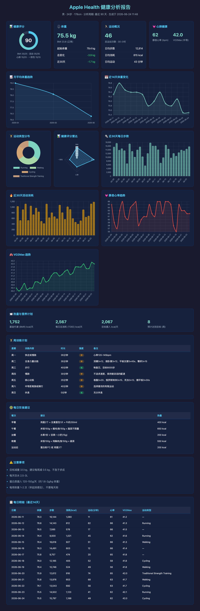

# Apple Health Analyzer

从 Apple Health 导出数据中提取、分析和可视化你的健康趋势。支持体重追踪、运动分析、心肺功能评估，并生成个性化训练计划。




## 功能

- **体重趋势分析**：月均值、日均值、波动范围，区分真实增重与水分波动
- **运动记录统计**：自动识别运动类型，按类型/时间维度汇总
- **心肺功能评估**：静息心率、VO2Max 趋势追踪
- **活动能量消耗**：日/周/月活动消耗分析
- **TDEE 估算**：基于 BMR + 活动消耗计算每日总消耗
- **个性化训练计划**：根据体重目标和当前运动水平自动生成
- **健康评分**：综合多项指标给出 0-100 分
- **可视化报告**：生成带图表的 HTML 报告

## 快速开始

### 安装

```bash
git clone https://github.com/gggggg171/apple-health-analysis.git
cd apple-health-analysis
```

无需安装任何依赖，纯 Python 标准库。

### 使用

```bash
# 分析 zip 文件（推荐）
python analyze.py ~/Downloads/apple_health_export.zip --target 72 --html

# 分析解压后的目录
python analyze.py /path/to/apple_health_export/ --target 72 --html

# 只看最近 30 天
python analyze.py data.zip --days 30 --html

# 监控模式：自动检测新文件并分析
python analyze.py ~/HealthExport/ --watch --target 72 --html
```

### 如何从 iPhone 导出数据

1. 打开 iPhone「健康」App
2. 点右上角头像 → 「导出所有健康数据」
3. 选「存储到"文件"」→ iCloud Drive → 选一个文件夹
4. 导出文件名为 `导出.zip`，会自动同步到 Mac
5. 用 `--watch` 模式自动检测并分析

## 每周工作流

```
iPhone 健康 App → 导出「导出.zip」→ iCloud Drive → Mac 自动分析 → HTML 报告
```

启动监控后，每周只需在 iPhone 上点一次「导出」，Mac 会自动完成剩下的一切：

```bash
# 在 Mac 终端运行（首次）
mkdir -p ~/Library/Mobile\ Documents/com~apple~CloudDocs/HealthExport

# 把 iPhone 导出的「导出.zip」放到这个目录
# 然后启动监控
python analyze.py ~/Library/Mobile\ Documents/com~apple~CloudDocs/HealthExport/ \
    --watch --target 72 --html --interval 300
```

报告保存在 `HealthExport/reports/` 目录下，`latest.html` 始终指向最新报告。

## 项目结构

```
apple-health-analysis/
├── analyze.py              # CLI 入口
├── lib/
│   ├── parser.py           # XML 流式解析 + zip 解压
│   ├── json_import.py      # JSON 数据导入
│   ├── metrics.py          # 健康指标计算
│   ├── report.py           # 文本报告
│   ├── html_report.py      # 可视化 HTML 报告（Chart.js）
│   ├── training_plan.py    # 训练计划生成
│   └── watcher.py          # 文件夹监控
├── configs/
│   ├── hermes/SKILL.md     # Hermes Agent 技能配置
│   ├── claude-code/        # Claude Code 技能配置
│   └── codex/AGENTS.md     # Codex 技能配置
└── README.md
```

## AI Agent 集成

| 平台 | 配置文件 | 使用方式 |
|------|---------|---------|
| [Hermes Agent](https://hermes-agent.nousresearch.com) | `configs/hermes/SKILL.md` | 复制到 `~/.hermes/skills/` |
| [Claude Code](https://code.claude.com) | `configs/claude-code/apple-health.md` | 复制到 `.claude/skills/` |
| [Codex](https://github.com/openai/codex) | `configs/codex/AGENTS.md` | 复制到项目根目录 |

## 隐私

- 所有分析在本地完成，数据不上传任何服务器
- Apple Health XML 文件不被修改或复制
- 报告文件仅保存在你指定的位置

## License

MIT
